# 01 - Getting started the right way

## Parts of the guitar

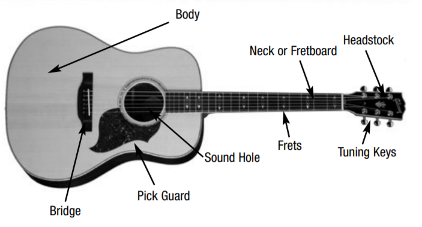

## The guitar strings

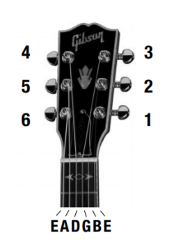

## Hand technique

### Left hand

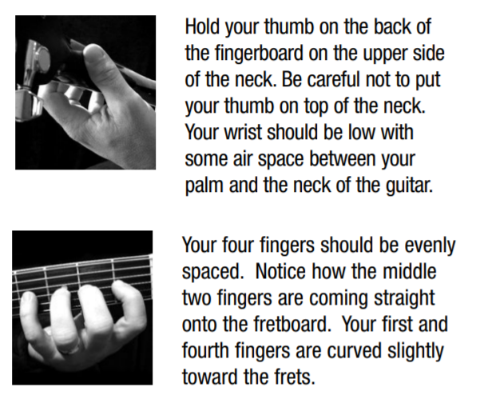

### Right hand

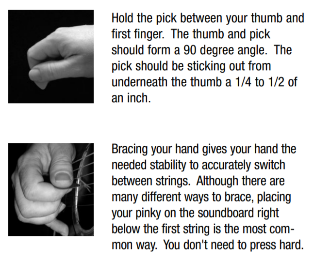

## Tuning your guitar

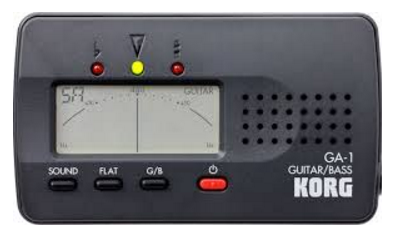

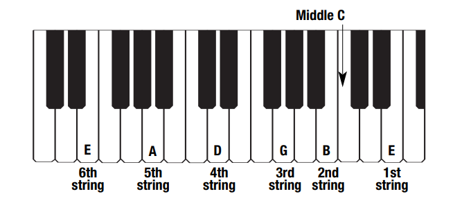

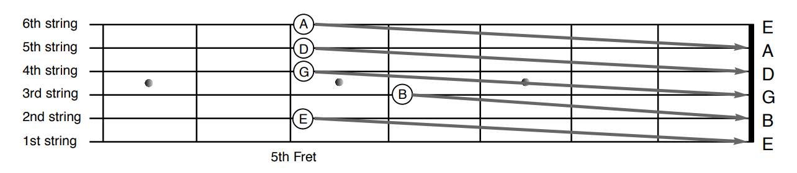

## Reading tablature

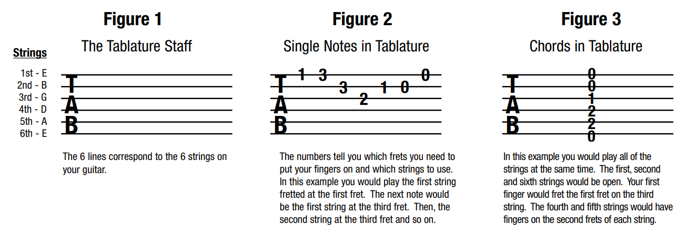

## Tab exercises

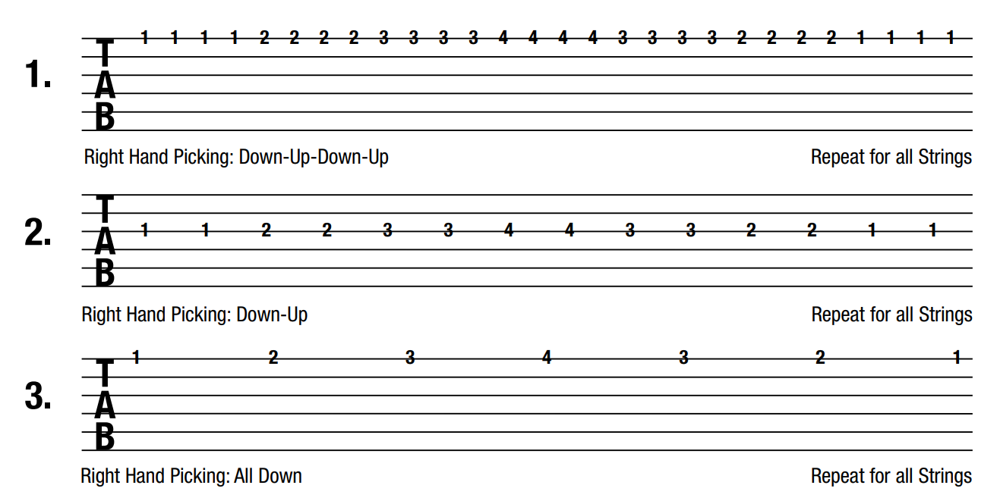

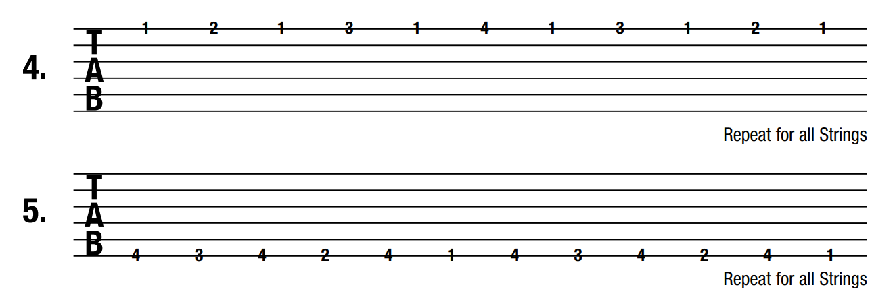

## Guitar chord blocks

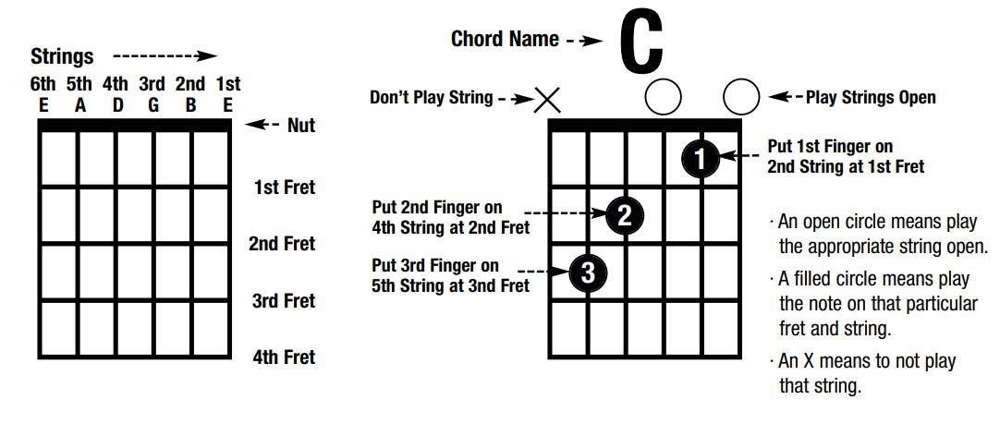

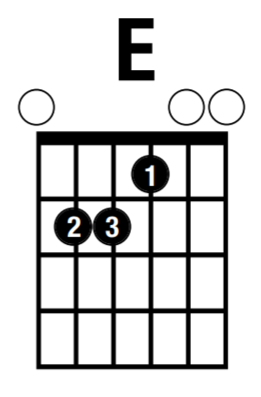

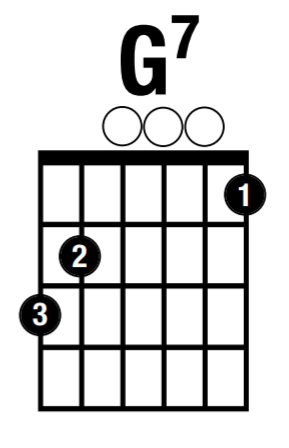

## Chord exercises

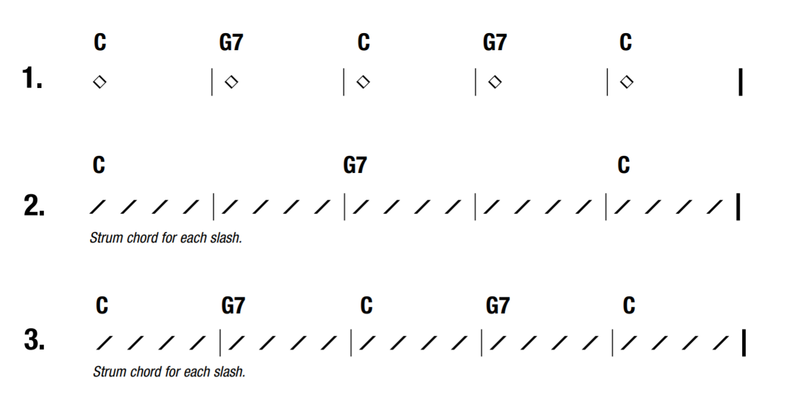

