# 02 - Reading musical notes on the 1st and 2nd strings

## How to read music

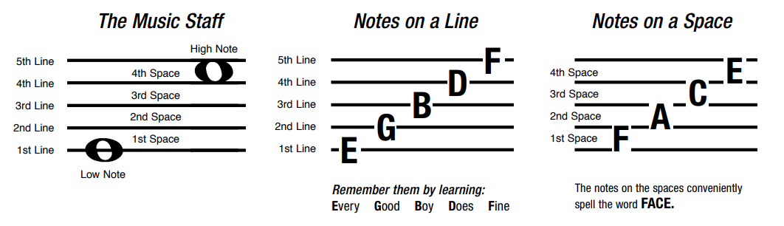

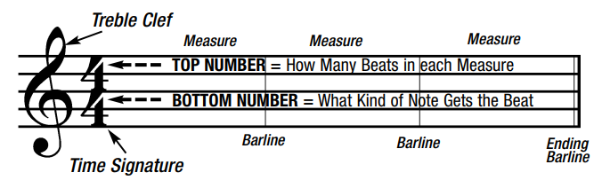

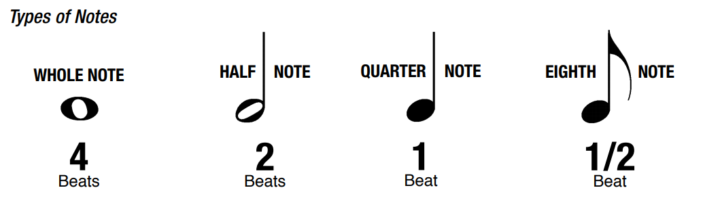

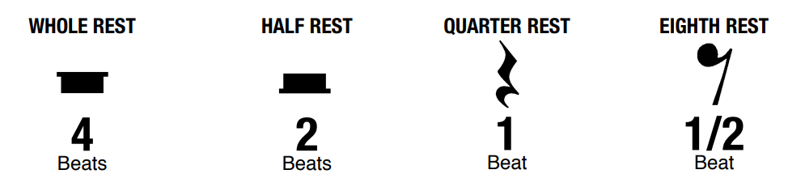

## Notes on the 1st string

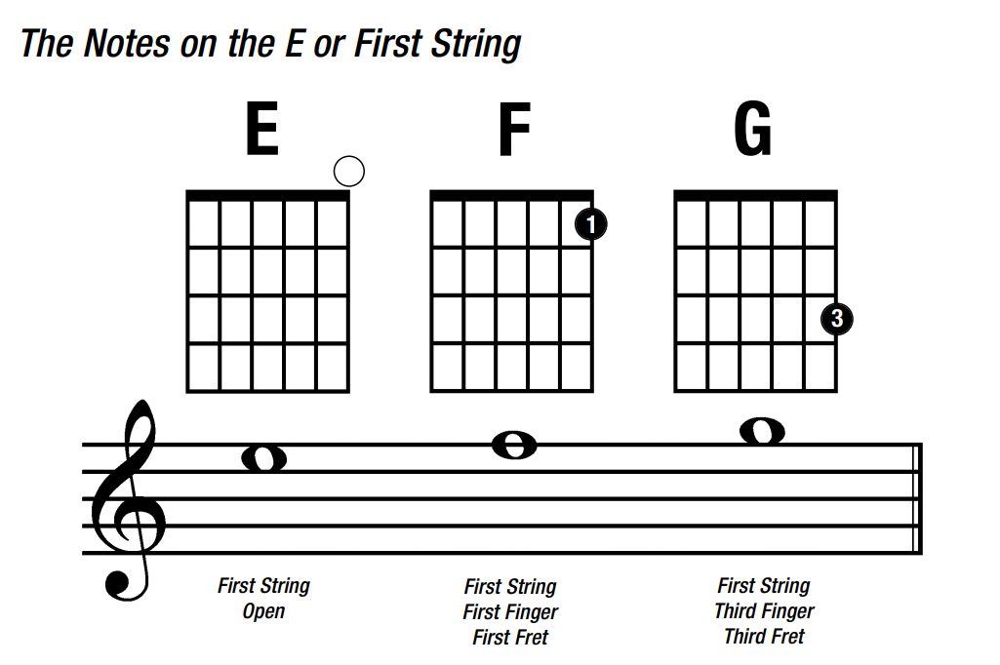

## 1st string note exercises

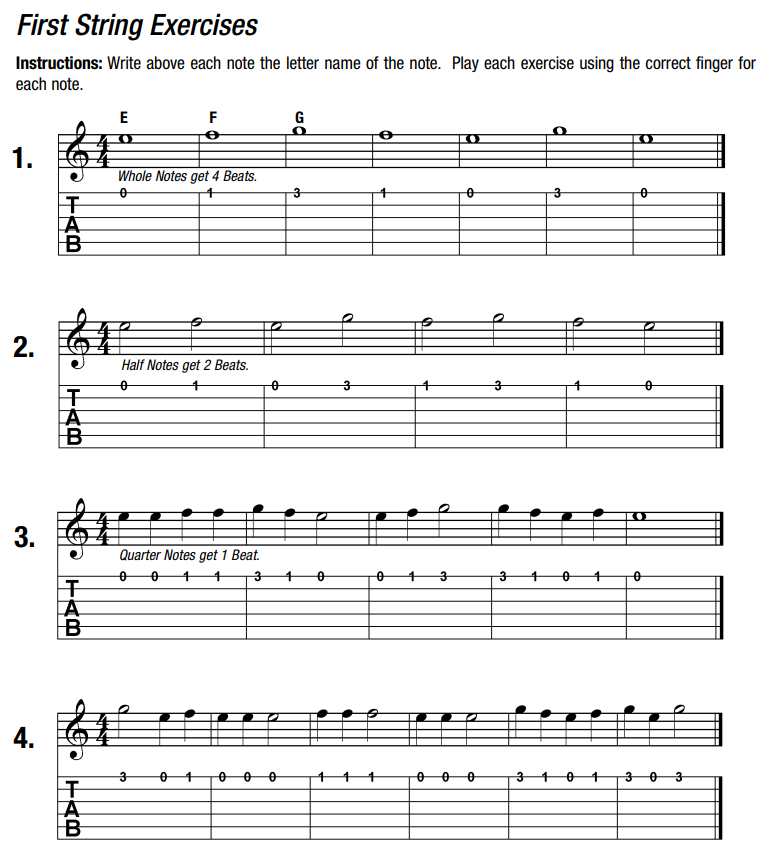

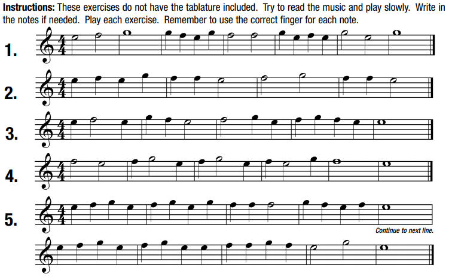

## Notes on the 2nd string

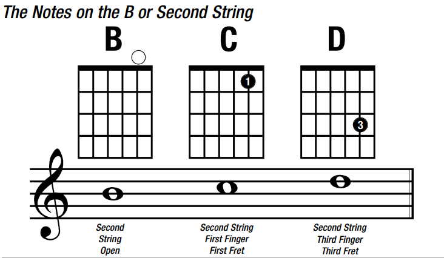

## 2nd string note exercises

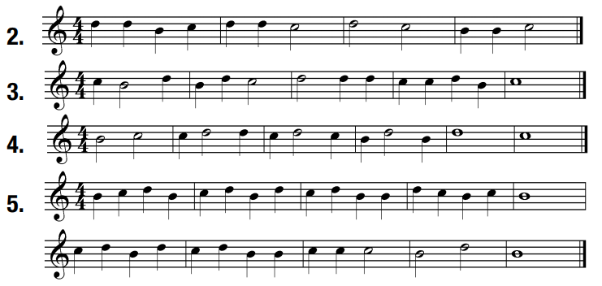

## 1st and 2nd string exercises

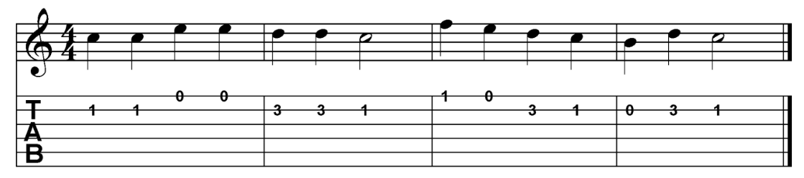

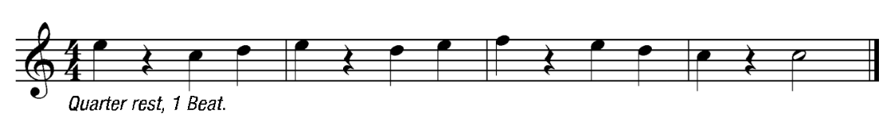

## Song: Ode to Joy

