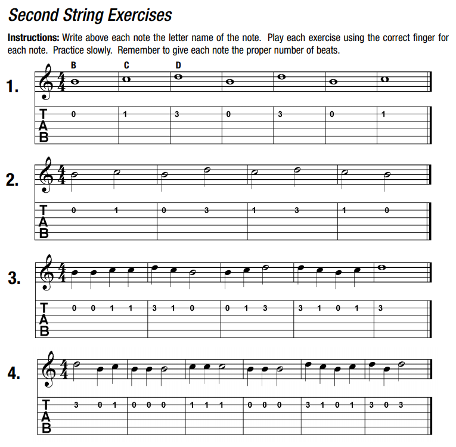
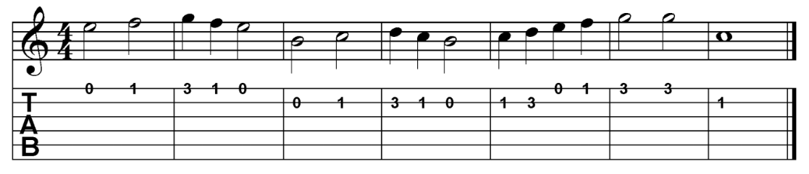
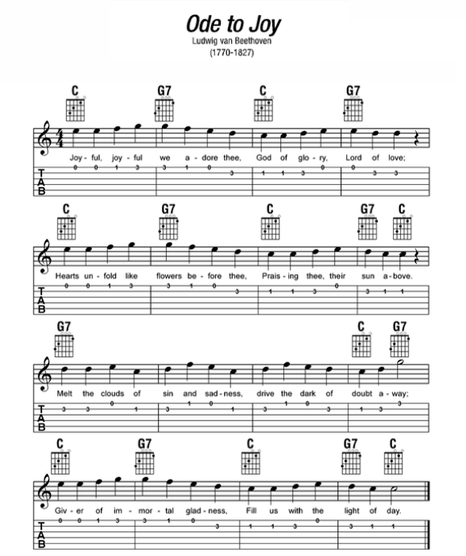

# 02 - Reading musical notes on the 1st and 2nd strings

## How to read music

## Notes on the 1st string

## 1st string note exercises

## Notes on the 2nd string

## 2nd string note exercises

## 1st and 2nd string exercises

## Song: Ode to Joy

