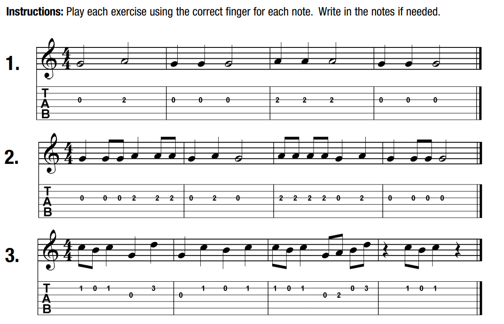

# 03 - Notes on the 3rd and 4th strings

## A little more music theory

### Dots

### Repeats

### Ties

* [Tied notes - studybass](https://www.studybass.com/lessons/reading-music/tied-notes/)
* [How to read music: dot and ties - YouTube](https://www.youtube.com/watch?v=kgF1eCz7-rE)

## Eighth notes

NOTE: _"Eighth notes beamed together is equal to a quarter note"_ **in time**.

## Eighth note exercises

## Notes on the 3rd string

## 3rd string note exercise

NOTE: next one has rhythm changed to **3/4**.

## Notes on the 4th string

## 4th string note exercise

## Song: Yankee Doodle

## Song: When the saints go marching in

## Song: Aura Lee

