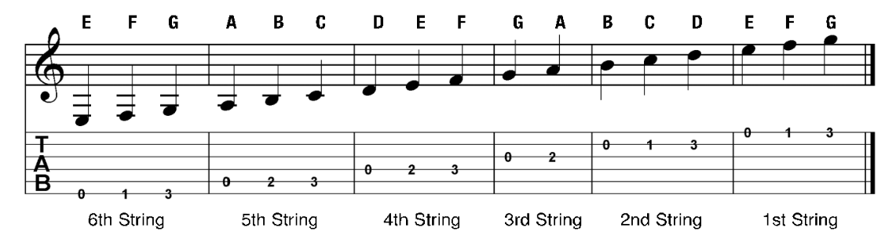
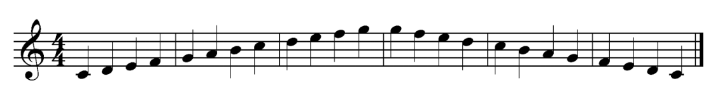
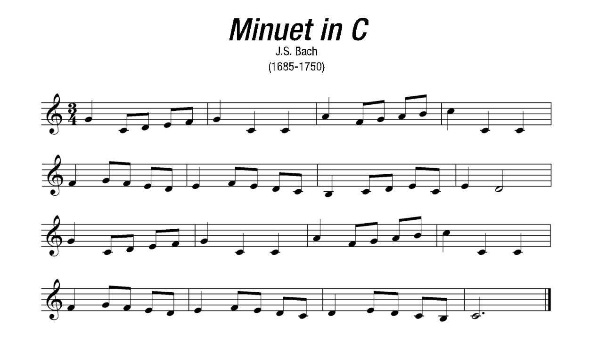
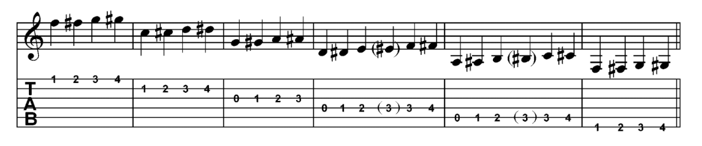
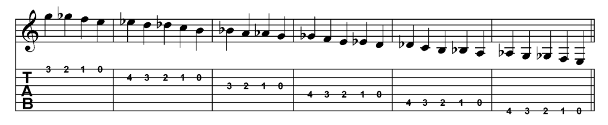
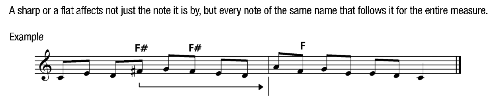
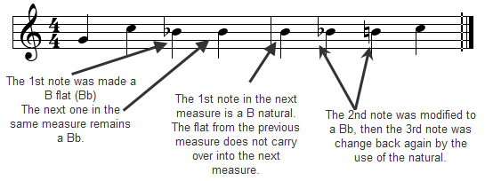

# 04 - Notes on the 5th and 6th strings

## Notes on the 5th string

### 5th string exercises

## Notes on the 6th string

### 6th string exercises

NOTE: rhythm in this one is 3/4.

## Notes in the first position

### Full scale

Go and memorize it. You need to be able to map each note from the staff into strings.

### C-major scale

## Song: Minuet in C

## Sharps, flats and naturals

### Sharps

Symbol: ♯

### Flats

Symbol:♭

### Naturals

Symbol: ♮

Represents the original note. Since sharps or flats affects all future notes of the same name that follows, it cancels previous modifications and refers to the original note.

