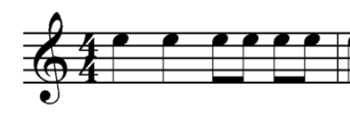
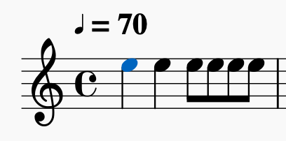

# Interlude - Beam notation

Not bad, but this is preferred:

* [Note beaming and grouping in music theory - musicnotes](https://www.musicnotes.com/now/musictheory/note-beaming-and-grouping-in-music-theory/)

